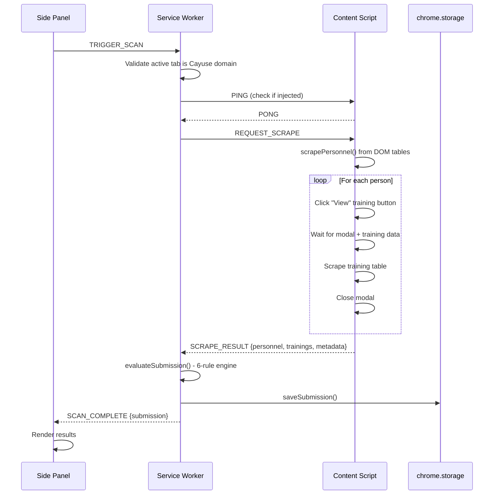
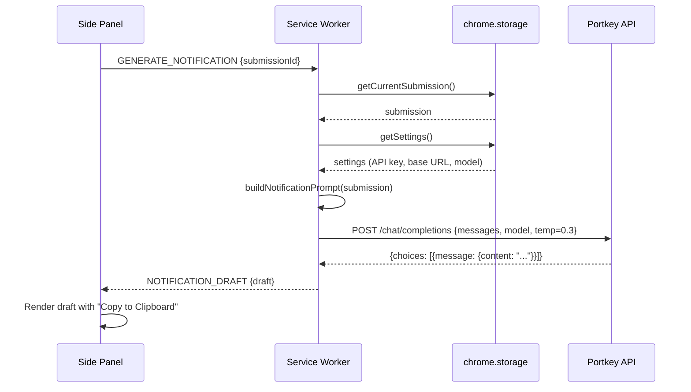

# Architecture Overview

**Last Reviewed:** 2026-03-04

## 1. System Context

The IRB CITI Compliance Checker is a Chrome extension that automates CITI (Collaborative Institutional Training Initiative) Human Subjects training compliance verification for IRB submissions at Kennesaw State University (KSU).

**Users:** IRB compliance staff at KSU who review submission forms in Cayuse.

**External systems:**

| System | Interaction | Direction |
|--------|------------|-----------|
| Cayuse IRB (3 KSU domains) | DOM scraping of personnel tables and training modals | Read-only |
| Portkey API Gateway (proxies to OpenAI) | LLM chat completions for email drafting | Request/Response |

**What the extension does NOT do:**
- Does not write back to Cayuse or modify any submission data
- Does not send emails (drafts are copied to clipboard for manual sending)
- Does not report analytics or telemetry to any external service
- Does not access any pages outside the three KSU Cayuse domains

## 2. Component Architecture

The extension is a Chrome Manifest v3 extension with four runtime contexts:

```
┌─────────────────────────────────────────────────────────┐
│ Chrome Browser                                          │
│                                                         │
│  ┌──────────────────┐    chrome.runtime     ┌────────┐  │
│  │   Side Panel     │◄────────────────────► │Service │  │
│  │ (sidepanel/)     │    .sendMessage()     │Worker  │  │
│  │                  │                        │        │  │
│  │  - UI rendering  │                        │ - Msg  │  │
│  │  - User events   │                        │   hub  │  │
│  │  - Settings      │                        │ - Eval │  │
│  └──────────────────┘                        │ - LLM  │  │
│                                              │ - Store│  │
│  ┌──────────────────┐    chrome.tabs         │        │  │
│  │  Content Script   │◄────────────────────► │        │  │
│  │ (Cayuse pages)    │   .sendMessage()      │        │  │
│  │                   │                       └───┬────┘  │
│  │  - DOM scraping   │                           │       │
│  │  - Modal control  │                      fetch()      │
│  │  - Page detection │                           │       │
│  └──────────────────┘                           ▼        │
│                                          ┌───────────┐   │
│                                          │Portkey API│   │
│                                          └───────────┘   │
└─────────────────────────────────────────────────────────┘
```

### 2.1 Service Worker (`src/background/service-worker.ts`)

Central message hub and orchestrator. Handles all inter-component communication.

**Message types handled:**

| Message | Source | Action |
|---------|--------|--------|
| `TRIGGER_SCAN` | Side Panel | Validates Cayuse tab, injects content script, dispatches `REQUEST_SCRAPE`, evaluates compliance, persists results |
| `GENERATE_NOTIFICATION` | Side Panel | Loads submission + settings, builds LLM prompt, calls Portkey API, returns draft |
| `GET_SUBMISSION` | Side Panel | Returns current submission from storage |
| `GET_SETTINGS` | Side Panel | Returns settings from storage |
| `SAVE_SETTINGS` | Side Panel | Persists settings to storage |
| `PAGE_DETECTED` | Content Script | Receives page type notification (no action) |

**Key behaviors:**
- Validates active tab URL against `CAYUSE_DOMAINS` array before scraping
- Uses `ensureContentScript()` to inject content script if not already active (PING/PONG check)
- Runs compliance evaluation via `evaluateSubmission()` after receiving scraped data
- Persists results to `chrome.storage.local` via `saveSubmission()`

### 2.2 Content Script (`src/content/cayuse-scraper.ts`, `page-detector.ts`, `selectors.ts`)

Injected on Cayuse domains only (declared in `manifest.json` `content_scripts` and as fallback via `chrome.scripting.executeScript()`). Runs at `document_idle`.

**Responsibilities:**
- Scrapes personnel data from submission form tables (sections 1.2 KSU and 1.3 Non-KSU)
- Opens training modals sequentially per person, scrapes training records, closes modals
- Detects Cayuse page type via hash-based SPA routing
- Monitors SPA navigation via `MutationObserver` + `hashchange` listener

**Centralized selectors** (`src/content/selectors.ts`):
- Personnel containers: `[class*="assignment-type-"]`
- Data cells: `td.e3-table-row-cell`
- Training view buttons: `td.open-person-training-cell`
- Training modal: `.modal-dialog.training-finder`
- Training table: `.training-finder table.e3-table`
- Modal close: `.modal.fade.in .close`

**Timing constants:**
- `MODAL_TIMEOUT`: 5000ms (max wait for modal to open/load)
- `MODAL_CYCLE_DELAY`: 300ms (pause between close and next open)
- Polling interval: 200ms (checking for training data load)
- Uses `MutationObserver`-based `waitForElement()` / `waitForElementRemoved()`

### 2.3 Side Panel (`src/sidepanel/`)

Vanilla TypeScript UI with no framework. Renders compliance results and provides settings configuration.

**Components** (`src/sidepanel/components/`):

| Component | File | Purpose |
|-----------|------|---------|
| `submission-header.ts` | Renders title, protocol number, scan timestamp, compliance badge |
| `personnel-list.ts` | Groups personnel by status (deficient first, then compliant) |
| `personnel-card.ts` | Individual person card with status, trainings, deficiency details |
| `status-badge.ts` | Color-coded status label rendering |
| `deficiency-report.ts` | Summary counts by deficiency type |
| `notification-draft.ts` | LLM-generated email display with "Copy to Clipboard" button |

**XSS prevention:** All components use `escapeHtml()` (DOM-based: create div, set `textContent`, read `innerHTML`) before inserting scraped or computed text into the page.

### 2.4 Library Layer (`src/lib/`)

| Module | File | Purpose |
|--------|------|---------|
| CITI Evaluator | `citi-evaluator.ts` | 6-rule compliance engine (see Section 5) |
| LLM Client | `llm-client.ts` | OpenAI-compatible chat completion client via Portkey |
| Storage | `storage.ts` | `chrome.storage.local` wrappers for 3 keys |
| Notification Templates | `notification-templates.ts` | Prompt builder for LLM deficiency emails |
| Date Utils | `date-utils.ts` | CITI 3-year validity calculations |

## 3. Message Flow

### 3.1 Scan Flow



### 3.2 Notification Generation Flow



## 4. Build System

**Stack:** Vite 6.x + TypeScript 5.7 (zero runtime dependencies)

**Entry points** (configured in `vite.config.ts`):

| Entry | Source | Output |
|-------|--------|--------|
| service-worker | `src/background/service-worker.ts` | `dist/service-worker.js` |
| content-script | `src/content/cayuse-scraper.ts` | `dist/content-script.js` |
| sidepanel | `src/sidepanel/index.html` | `dist/sidepanel/index.html` + JS/CSS |

**Build commands:**
- `npm run build` - Type check + Vite build
- `npm run dev` - Vite build in watch mode
- `npm run typecheck` - Type check only

**Build output** (`dist/`):
- `manifest.json` (copied from root)
- `service-worker.js` + `.map`
- `content-script.js` + `.map`
- `sidepanel/index.html` + JS + CSS
- `assets/icon-{16,48,128}.png`

**Build configuration:**
- Target: `esnext`
- Minification: disabled
- Source maps: enabled
- Path alias: `@` -> `src/`
- Custom Vite plugin copies `manifest.json` and `src/assets/` to `dist/`

## 5. Compliance Evaluation Rules

The evaluator (`src/lib/citi-evaluator.ts`) checks each person against rules in this order:

| # | Rule | Status | Applies To | Trigger |
|---|------|--------|-----------|---------|
| 1 | No training found | `missing` / `external` | All | Zero training records matched to person |
| 2 | Training pending sync | `pending_sync` | All | Training completed today, no current records yet |
| 3 | All training expired | `expired` | All | All records >3 years old (from completion date) |
| 4 | Email mismatch | `email_mismatch` | KSU only | CITI registered email is not a KSU email |
| 5 | External without PDF | `external` | Non-KSU only | Has valid training but no PDF certificate in Cayuse |
| 6 | All checks pass | `compliant` | All | No deficiencies found |

**KSU determination:** Email domain is `kennesaw.edu` or `students.kennesaw.edu`, OR institution field contains "kennesaw".

**Training validity:** 3 years from completion date (`CITI_VALIDITY_YEARS = 3` in `date-utils.ts`).

**Submission-level compliance:** Overall submission is compliant only if ALL personnel are individually compliant.

## 6. Type System

| File | Types Defined | Purpose |
|------|---------------|---------|
| `src/types/models.ts` | `DeficiencyType`, `CitiTraining`, `Deficiency`, `CitiStatus`, `PersonnelRecord`, `Submission`, `SubmissionScan`, `ExtensionSettings`, `STATUS_COLORS` | Domain model |
| `src/types/messages.ts` | 16 message interfaces + 5 union types (`ContentToBackgroundMessage`, `BackgroundToContentMessage`, `SidepanelToBackgroundMessage`, `BackgroundToSidepanelMessage`, `ExtensionMessage`) | IPC protocol |
| `src/types/cayuse.ts` | `ScrapedPersonnel`, `ScrapedTraining`, `ScrapedSubmissionData` | Raw scraped data shapes |
