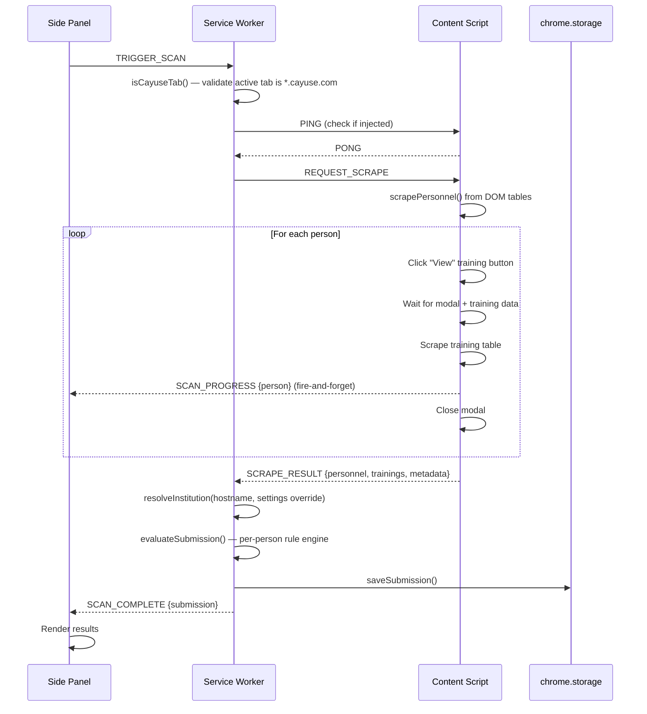
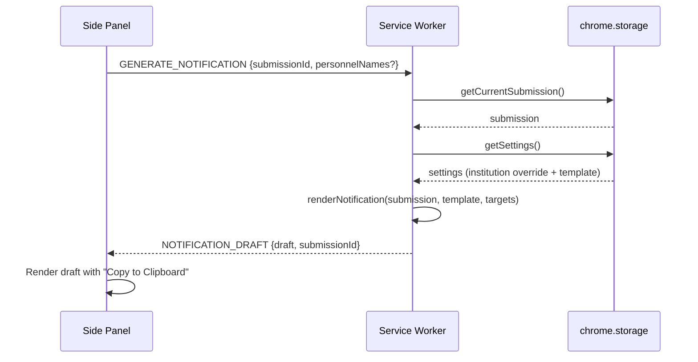

# Architecture Overview

**Last Reviewed:** 2026-06-04

## 1. System Context

The IRB CITI Compliance Checker is a Chrome extension that automates CITI
(Collaborative Institutional Training Initiative) Human Subjects training
compliance verification for IRB submissions in Cayuse. It is
institution-neutral: it works at any institution whose IRB runs on Cayuse, with
no per-site code changes.

**Users:** IRB compliance staff who review submission forms in Cayuse.

**External systems:**

| System | Interaction | Direction |
|--------|------------|-----------|
| Cayuse IRB (any `*.cayuse.com` tenant) | DOM scraping of personnel tables and training modals | Read-only |

The extension is **fully offline**. It makes **zero network requests** and
integrates with no external services, APIs, or AI/LLM providers. Notification
text is produced locally by a deterministic template renderer (see Section 2.4).

> Historical note: earlier prototypes drafted notifications by calling a hosted
> LLM gateway. That dependency — and all associated API keys and network
> traffic — has been removed. The current extension contacts nothing.

**What the extension does NOT do:**

- Does not write back to Cayuse or modify any submission data
- Does not send emails (drafts are copied to the clipboard for manual sending)
- Does not report analytics or telemetry to any external service
- Does not make any network requests of any kind
- Does not access any pages outside `*.cayuse.com`

## 2. Component Architecture

The extension is a Chrome Manifest v3 extension with three runtime contexts that
communicate over Chrome's messaging APIs. All processing happens inside the
browser; there is no backend.

```
┌─────────────────────────────────────────────────────────┐
│ Chrome Browser                                          │
│                                                         │
│  ┌──────────────────┐    chrome.runtime     ┌────────┐  │
│  │   Side Panel     │◄────────────────────► │Service │  │
│  │ (sidepanel/)     │    .sendMessage()     │Worker  │  │
│  │                  │                        │        │  │
│  │  - UI rendering  │                        │ - Msg  │  │
│  │  - User events   │                        │   hub  │  │
│  │  - Settings      │                        │ - Eval │  │
│  └──────────────────┘                        │ - Tmpl │  │
│                                              │ - Store│  │
│  ┌──────────────────┐    chrome.tabs         │        │  │
│  │  Content Script   │◄────────────────────► │        │  │
│  │ (Cayuse pages)    │   .sendMessage()      └────────┘  │
│  │                   │                                   │
│  │  - DOM scraping   │       (no outbound network)       │
│  │  - Modal control  │                                   │
│  │  - Page detection │                                   │
│  └──────────────────┘                                   │
└─────────────────────────────────────────────────────────┘
```

### 2.1 Service Worker (`src/background/service-worker.ts`)

Central message hub and orchestrator. Handles all inter-component communication,
runs the compliance evaluation, resolves the home institution, and renders
notification text from a template.

**Message types handled:**

| Message | Source | Action |
|---------|--------|--------|
| `TRIGGER_SCAN` | Side Panel | Validates the active tab is a Cayuse page, injects the content script, dispatches `REQUEST_SCRAPE`, resolves the institution, evaluates compliance, persists results |
| `GENERATE_NOTIFICATION` | Side Panel | Loads the submission + settings, renders the PI notification from the template, returns the draft text |
| `RETURN_TO_PI` | Side Panel | Forwards a `REQUEST_NAVIGATE` to the content script (navigator is a documented stub — see Section 2.2) |
| `GET_SUBMISSION` | Side Panel | Returns the current submission from storage |
| `GET_SETTINGS` | Side Panel | Returns settings from storage |
| `SAVE_SETTINGS` | Side Panel | Persists settings to storage |
| `SCAN_PROGRESS` | Content Script | Fire-and-forget broadcast; relayed to the Side Panel without a response |
| `PAGE_DETECTED` | Content Script | Page-type notification; returns current settings |

**Key behaviors:**

- Validates the active tab via `isCayuseTab()`, a hostname-suffix check
  (`cayuse.com` or `*.cayuse.com`). This single check is what makes the
  extension work at any institution with no per-site configuration.
- Uses `ensureContentScript()` to inject the content script if not already
  active (PING/PONG check), then re-injects idempotently as a fallback.
- Resolves the home institution with `resolveInstitution()`: an explicit
  Settings override wins, otherwise the institution is auto-detected from the
  Cayuse hostname (see Section 2.4, Institution).
- Runs compliance evaluation via `evaluateSubmission()` after receiving scraped
  data, passing in the resolved institution.
- Renders the PI notification with `renderNotification()` using the saved
  template (or the built-in default).
- Persists results to `chrome.storage.local` via `saveSubmission()`.

### 2.2 Content Script (`src/content/cayuse-scraper.ts`, `page-detector.ts`, `selectors.ts`, `cayuse-navigator.ts`)

Injected on Cayuse pages only (declared in `manifest.json` `content_scripts`
matching `*://*.cayuse.com/*`, and re-injected as a fallback via
`chrome.scripting.executeScript()`). Runs at `document_idle`.

**Responsibilities:**

- Scrapes personnel data from submission form tables (home-institution and
  external-collaborator sections)
- Opens training modals sequentially per person, scrapes training records,
  closes modals
- Emits a `SCAN_PROGRESS` broadcast per person (fire-and-forget)
- Detects the Cayuse page type via hash-based SPA routing
- Monitors SPA navigation via `MutationObserver` + `hashchange` listener

**Return-to-PI navigator (`cayuse-navigator.ts`) — intentional stub.** The
extension generates notification *text*; it does **not** click through Cayuse's
UI to return a submission. `executeReturnToPi()` currently returns a clear
"not yet configured" message instructing staff to navigate and paste manually.
The exact Cayuse return flow varies and is pending SME input; the TODO block in
that file lists the selectors and steps an implementer would need to supply. The
helper functions (`navigateToHash()`, `waitForElement()`) are present for that
future work. **This stub is intentional — do not remove it or treat it as a
bug.**

**Centralized selectors** (`src/content/selectors.ts`):

- Personnel containers: `[class*="assignment-type-"]`
- Data cells: `td.e3-table-row-cell`
- Training view buttons: `td.open-person-training-cell`
- Training modal: `.modal-dialog.training-finder`
- Training table: `.training-finder table.e3-table`
- Modal close: `.modal.fade.in .close`

**Timing constants:**

- `MODAL_TIMEOUT`: 5000ms (max wait for modal to open/load)
- `MODAL_CYCLE_DELAY`: 300ms (pause between close and next open)
- Polling interval: 200ms (checking for training data load)
- Uses `MutationObserver`-based `waitForElement()` / `waitForElementRemoved()`

### 2.3 Side Panel (`src/sidepanel/`)

Vanilla TypeScript UI with no framework (`main.ts` + components). Renders
compliance results, the generated notification draft, and provides settings
configuration.

**Components** (`src/sidepanel/components/`):

| Component | File | Purpose |
|-----------|------|---------|
| Submission header | `submission-header.ts` | Title, protocol number, scan timestamp, compliance badge |
| Personnel list | `personnel-list.ts` | Groups personnel by status (deficient first, then compliant) |
| Personnel card | `personnel-card.ts` | Individual person card with status, trainings, deficiency details |
| Status badge | `status-badge.ts` | Color-coded status label rendering |
| Deficiency report | `deficiency-report.ts` | Summary counts by deficiency type |
| Scan progress | `scan-progress.ts` | Per-person scan progress bar driven by `SCAN_PROGRESS` broadcasts |
| Notification draft | `notification-draft.ts` | Renders the locally generated draft, the "generate" CTA prompt, the generating state, and a "Copy to Clipboard" button |

**XSS prevention:** All components use `escapeHtml()` (DOM-based: create a div,
set `textContent`, read `innerHTML`) before inserting scraped or computed text
into the page.

### 2.4 Library Layer (`src/lib/`)

| Module | File | Purpose |
|--------|------|---------|
| CITI Evaluator | `citi-evaluator.ts` | Per-person compliance engine (see Section 5) |
| Institution | `institution.ts` | Resolves the home institution from a Settings override or the Cayuse hostname; classifies each person as home vs. external |
| Notification Renderer | `notification-renderer.ts` | Deterministic, offline mail-merge of a notification template (see below) |
| Storage | `storage.ts` | `chrome.storage.local` wrappers (current submission, scan history, settings) |
| Date Utils | `date-utils.ts` | CITI 3-year validity calculations |

**Institution resolution (`institution.ts`).** Because remediation differs for
home-institution personnel versus external collaborators, the engine must know
who is "home." There is no hardcoded university. The home institution is
resolved from two sources, in priority order:

1. **Explicit override** — an institution display name and/or home email
   domains saved in Settings. Authoritative when present.
2. **Auto-detection** — derived from the Cayuse subdomain. For example,
   `example-irb.cayuse.com` yields the token `example`, used to match personnel
   by email domain or free-text institution. Generic subdomain qualifiers
   (`irb`, `research`, `app`, etc.) are ignored.

Classification is heuristic by design; the override exists for cases where the
heuristic is too loose or too strict. See
[`docs/DEPLOYMENT_EXAMPLE.md`](../docs/DEPLOYMENT_EXAMPLE.md) for a worked
configuration example.

**Notification rendering (`notification-renderer.ts`).** Notification text is
produced by a pure, deterministic mail-merge — no model, no network, fully
testable. The compliance evaluator already emits a human-readable `description`
and `recommendation` for each deficiency, so composing the PI message is just
template expansion. Available merge fields:

| Field | Source |
|-------|--------|
| `{{piName}}` | The person whose role is PI (falls back to "Principal Investigator") |
| `{{protocolNumber}}` | Submission protocol number (falls back to submission id) |
| `{{submissionTitle}}` | Submission title |
| `{{institutionName}}` | Resolved home-institution name (falls back to "the institution") |
| `{{date}}` | Scan timestamp formatted as a readable date |
| `{{deficiencies}}` | One block per flagged person, assembled from structured evaluator output |

Staff may keep the built-in `DEFAULT_NOTIFICATION_TEMPLATE` or save their own in
Settings. Unknown placeholders are left intact. The rendered text is shown in
the side panel with a "Copy to Clipboard" button; staff paste it into Cayuse's
"Missing information or materials" field (or any correspondence) themselves.

## 3. Message Flow

### 3.1 Scan Flow



### 3.2 Notification Generation Flow

Notifications are rendered entirely locally — there is no external call.



On a fresh scan that finds deficiencies, the panel auto-triggers
`GENERATE_NOTIFICATION`. After a panel reload it instead shows a CTA prompt and
generates on click.

## 4. Build System

**Stack:** Vite + TypeScript (zero runtime dependencies). Tests run on Vitest;
CI and release run through GitHub Actions.

**Entry points** (configured in `vite.config.ts`):

| Entry | Source | Output |
|-------|--------|--------|
| service-worker | `src/background/service-worker.ts` | `dist/service-worker.js` |
| content-script | `src/content/cayuse-scraper.ts` | `dist/content-script.js` |
| sidepanel | `src/sidepanel/index.html` | `dist/sidepanel/index.html` + JS/CSS |

**Scripts:**

- `npm run build` — type check + Vite build → `dist/`
- `npm run dev` — Vite build in watch mode
- `npm run typecheck` — type check only (no build)
- `npm run test` — Vitest test suite
- `npm run package` — produce a distributable extension archive

**Build output** (`dist/`):

- `manifest.json` (copied from root)
- `service-worker.js` + `.map`
- `content-script.js` + `.map`
- `sidepanel/index.html` + JS + CSS
- `assets/icon-{16,48,128}.png`

**Build configuration:**

- Target: `esnext`
- Minification: disabled
- Source maps: enabled
- Path alias: `@` → `src/`
- Custom Vite plugin copies `manifest.json` and `src/assets/` to `dist/`

## 5. Compliance Evaluation Rules

`evaluatePerson()` in `src/lib/citi-evaluator.ts` checks each person in the
following order and returns on the first match. "Home" means the person belongs
to the resolved home institution; "external" means an external collaborator.

| Order | Rule | Status | Applies To | Trigger |
|-------|------|--------|-----------|---------|
| 1 | No training found | `external` / `missing` | All | Zero training records matched to the person (external with no records → flagged to attach a PDF certificate; otherwise → must complete/provide training) |
| 2 | Training pending sync | `pending_sync` | All | Training completed today, no current record synced into Cayuse yet |
| 3 | All training expired | `expired` | All | All records older than the validity window (from completion date) |
| 4 | Email mismatch (dormant) | `email_mismatch` | Home only | CITI registered email is not a home-institution email |
| 5 | External without PDF (dormant) | `external` | External only | Has valid training but no PDF certificate attached in Cayuse |
| 6 | All checks pass | `compliant` | All | No deficiencies found |

**Home-institution determination:** Handled by `isHomeInstitution()` in
`institution.ts`. A person is "home" when their email domain matches a
configured home domain, or when their email domain / free-text institution
contains the institution token (override name, override domain, or
hostname-derived). No university is hardcoded.

**Training validity:** Defined by `CITI_VALIDITY_YEARS` in `date-utils.ts`
(3 years from completion date).

**Submission-level compliance:** A submission is compliant only if **all**
personnel are individually compliant (`isSubmissionCompliant()`).

### 5.1 Dormant Rules — Intentionally Retained

Rules 4 (email mismatch) and 5 (external-without-PDF) are present but cannot
fully trigger today, because the Cayuse training modal does not expose the data
they depend on:

- **Email mismatch** needs the CITI `registeredEmail` from the training modal,
  which Cayuse does not display — `registeredEmail` is scraped as empty, so the
  mismatch branch never passes.
- **External without PDF** needs `hasPdfAttachment` from scraped training data,
  which Cayuse does not display — it is scraped as `false`. (As a result,
  external personnel who lack training records are currently flagged to attach
  their PDF, which is the expected behavior.)

These rules are kept intentionally for future data sources (e.g., a CITI API
integration or enhanced scraping). **Do not remove them.** See the DORMANT
RULES block in `citi-evaluator.ts` for details.

## 6. Type System

| File | Types Defined | Purpose |
|------|---------------|---------|
| `src/types/models.ts` | `DeficiencyType`, `CitiTraining`, `Deficiency`, `CitiStatus`, `PersonnelRecord`, `Submission`, `SubmissionScan`, `ExtensionSettings`, `STATUS_COLORS` | Domain model. `PersonnelRecord.isHomeInstitution` and `Submission.institutionName` carry the resolved institution. `ExtensionSettings` holds the optional institution override and notification template — no API keys. |
| `src/types/messages.ts` | Message interfaces + union types (`ContentToBackgroundMessage`, `BackgroundToContentMessage`, `SidepanelToBackgroundMessage`, `BackgroundToSidepanelMessage`, `ExtensionMessage`) | IPC protocol |
| `src/types/cayuse.ts` | `ScrapedPersonnel`, `ScrapedTraining`, `ScrapedSubmissionData` | Raw scraped data shapes |

## 7. Privacy & Data Handling

- All data (current submission, scan history, settings) lives only in
  `chrome.storage.local` and is never transmitted.
- The extension holds a single broad host permission, `*://*.cayuse.com/*`,
  plus `sidePanel`, `storage`, `activeTab`, and `scripting`. It can read only
  Cayuse pages and only while the user is using it.
- No analytics, telemetry, or third-party requests are made.

For a worked example of configuring the extension for a specific institution and
deploying it to staff, see
[`docs/DEPLOYMENT_EXAMPLE.md`](../docs/DEPLOYMENT_EXAMPLE.md).
